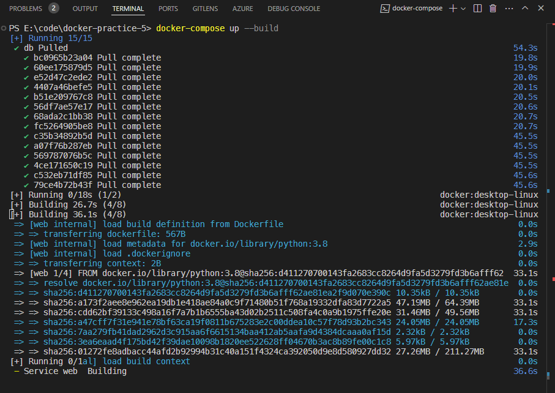
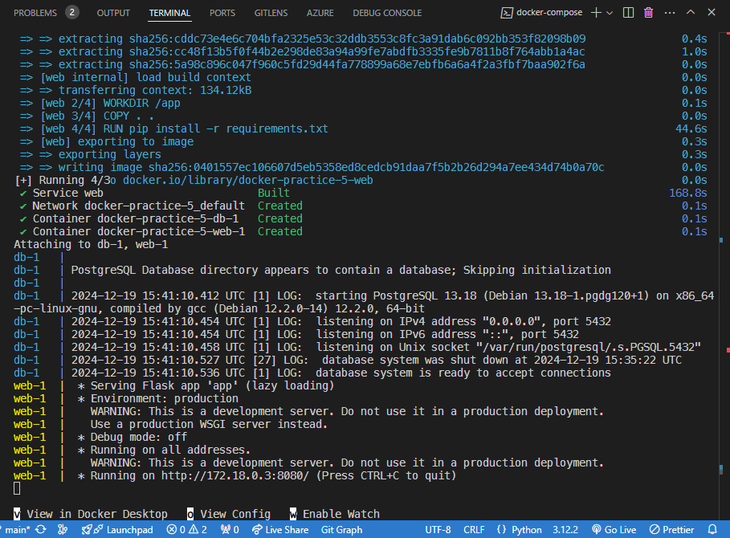
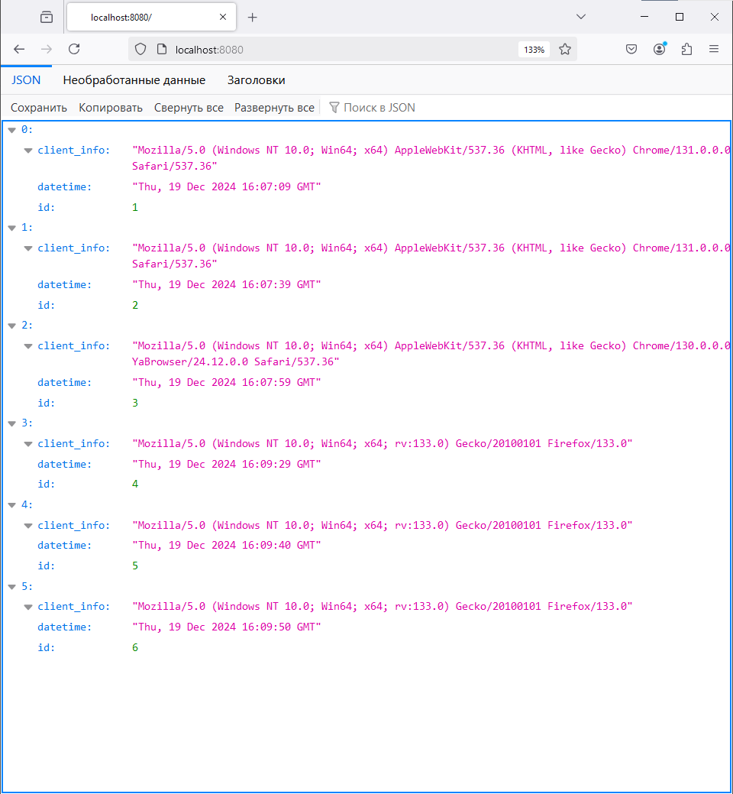

# docker-practice-5

Репозиторий для задания 5 курса "Проектирование и развертывание веб-решений в экосистеме Python". Магистерская программа Веб-технологии, Университет ИТМО, 2024

В задании нужно реализовать развертывание [приложения на Flask](https://gist.github.com/nzhukov/a2ba90e8d801e66d1319ee2bf962bc28) с использованием `docker-compose`.

## Инструкция по развертыванию решения

### 1. Клонирование репозитория

Чтобы склонировать репозиторий, можно использовать команду:

```bash
git clone https://github.com/strawberrycheeks/docker-practice-5.git
```

### 2. Запуск сервисов

Чтобы создать контейнеры и развернуть приложение, нужно использовать команду:

```bash
docker-compose up --build
```

Команда `docker-compose` запустит два сервиса: **web** и **db**.



Для сервиса **web** образ будет собран из текущей директории с использованием Dockerfile, а локальный порт 8080 хоста будет проброшен в порт 8080 контейнера. `depends_on` используется, чтобы указать зависимость сервиса **web** от сервиса **db** — гарантируется, что контейнер **db** будет запущен раньше.

Для сервиса **db** используется образ `postgres:13`, локальный порт 5432 перенаправляется в порт 5432 контейнера. Для сервиса также указан том `pgdata` — база данных будет сохранена на хосте, даже если контейнер будет удален.



Если контейнеры уже были созданы, то достаточно будет использовать команду `docker-compose start`.

### 3. Проверка работы приложения

Чтобы проверить, что контейнеры были созданы и запущены, нужно перейти по адресу: [http://localhost:8080](http://localhost:8080). Если приложение запустилось корректно, то в браузере откроется страница:



При каждом посещении страницы в таблицу будут добавляться новые записи о посещениях, данные будут отображены в формате JSON.
